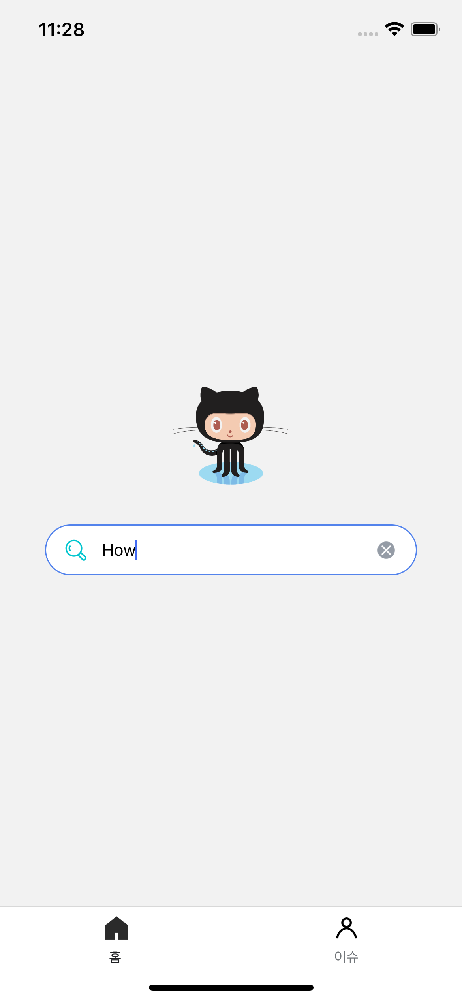

# Github Issues App
github Repository를 저장하고 해당 Repository의 issue들을 모아보는 앱입니다.

## 개발기간
___
- 2023.2.27 - 3.1

## 개발환경 및 기술스택
___
- React-Native(React Native CLI)
- TypeScript
- Recoil
- Styled-components

## 프로젝트 설치 및 시작
___

GitHub Token이 필요한 api이기 때문에 env폴더 내 `env.ts`에 token을 넣어주시면 됩니다.
```
npm install
npx react-native run ios //iOS
npx react-native run-android //Android
```

## 기능 구현
___
- Repository 입력 및 검색




- Repository 리스트 스크롤 & Repository 저장/삭제 구현 (4개 제한 , asyncStorage 사용)


- 저장한 Repository들의 issue 리스트 & Repository 삭제 구현


- issue 클릭 시 상세 페이지로 이동리스트


___
